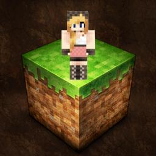
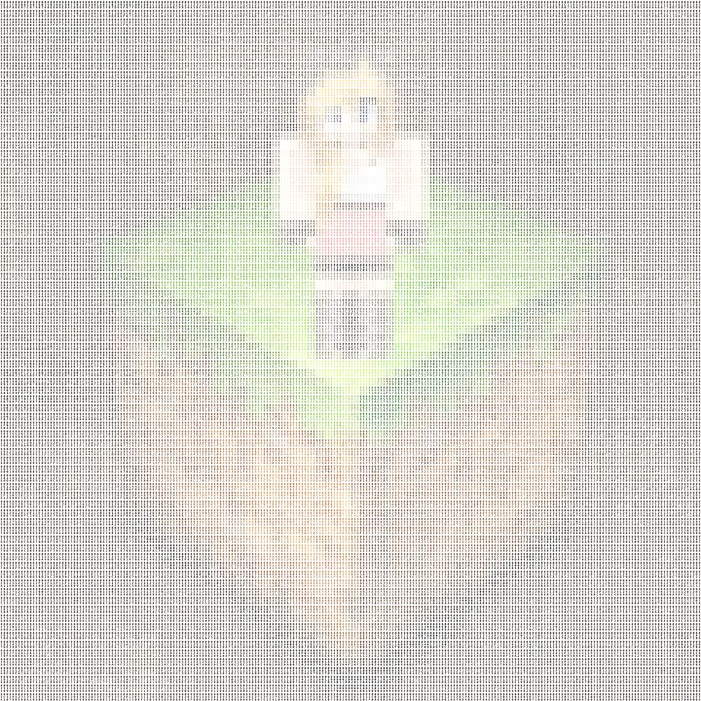

# convert_to_hex

Render an image as a mosaic where every source pixel becomes a tile
displaying that pixel's `#RRGGBB` code in its own color. Output is SVG.

| Input | Output preview |
| --- | --- |
|  |  |
|  |  |

## Usage

```sh
docker run --rm -v "$(pwd):/work" \
  ghcr.io/llacoste/convert-to-hex:latest \
  input.png output.svg --tile-size 110
```

| Flag | Default | Meaning |
| --- | --- | --- |
| `--tile-size N` | `110` | Edge length in px of each generated tile. |
| `-h`, `--help` | | Show help. |

## How it works

1. Open the image with [`image`](https://hex.pm/packages/image) (libvips), flatten any alpha onto white, normalize to sRGB.
2. Walk the raw pixel binary row-by-row as a `Stream`.
3. For each pixel, emit a tile: a 3×3 grid of single characters showing the pixel's hex padded to nine chars (`000RRGGBB`), drawn in the pixel's own color on a white background. The layout matches the original 2013 Ruby script.
4. Memoize the rendered tile per unique hex string. Photographs typically reuse exact colors heavily, so most tiles are cached-template substitutions rather than fresh string builds.
5. Stream the result to disk as it's generated. Memory is bounded by the *unique color count*, not source dimensions.

JetBrains Mono Bold, subset to `#0-9A-F` (the only glyphs we render), is embedded as a base64 `@font-face` in the SVG's `<defs>` — output renders identically in browsers, vector editors, and rasterizers without needing the font installed. License: SIL Open Font License 1.1 ([`priv/LICENSE-JetBrainsMono.txt`](priv/LICENSE-JetBrainsMono.txt)).

## Development

Everything runs in the Docker image — no host toolchain needed beyond Docker itself.

```sh
just convert input.png out.svg  # build local image and run against your source
just test                       # ExUnit suite
just compile                    # warnings-as-errors compile
just format-check               # mix format --check-formatted
just shell                      # interactive shell in the container
```

`just run` instead of `just convert` uses the published image from GHCR — skips the local build for when you just want to use the tool.

---

MIT licensed ([`LICENSE`](LICENSE)).
